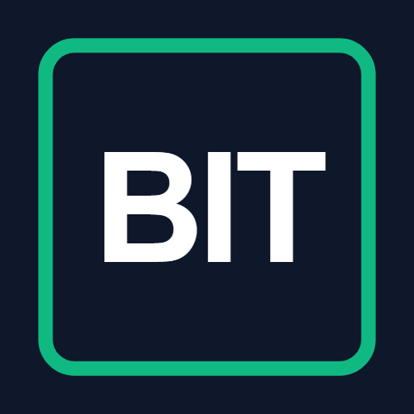
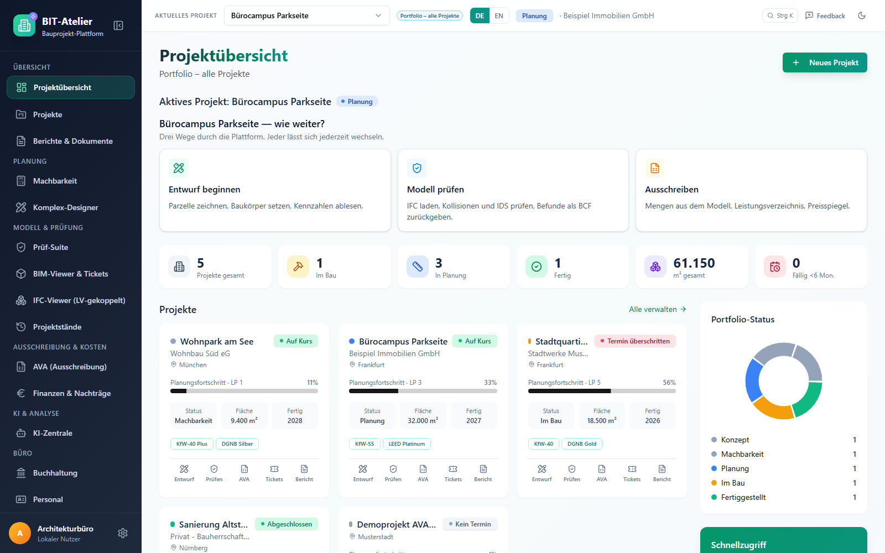
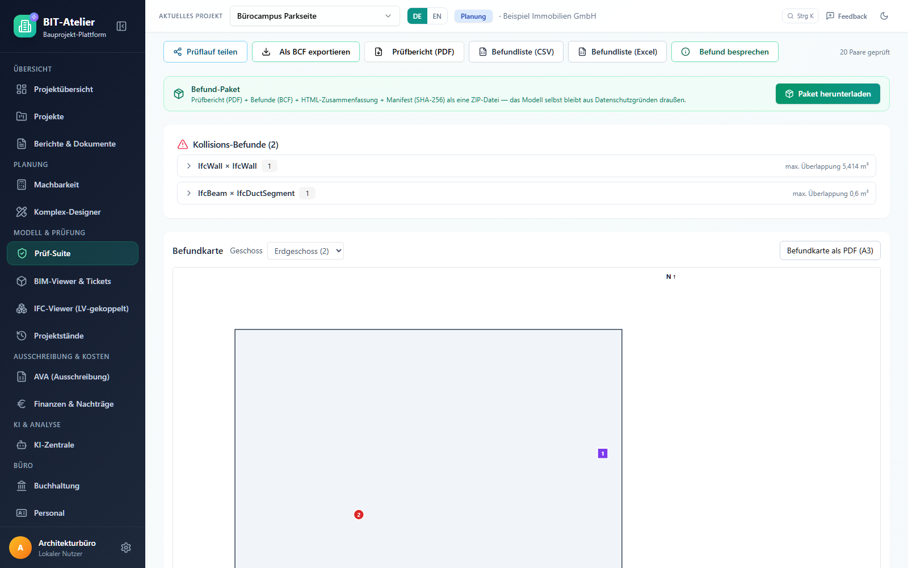
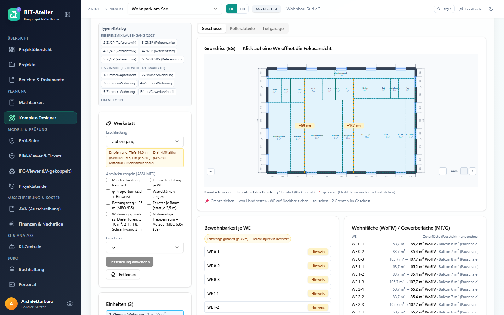
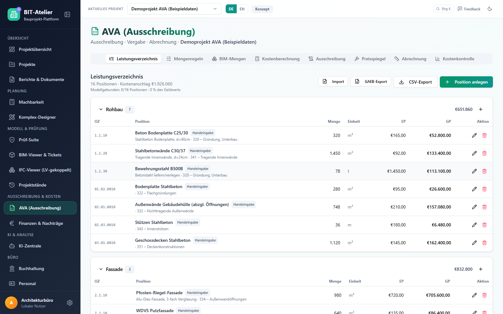
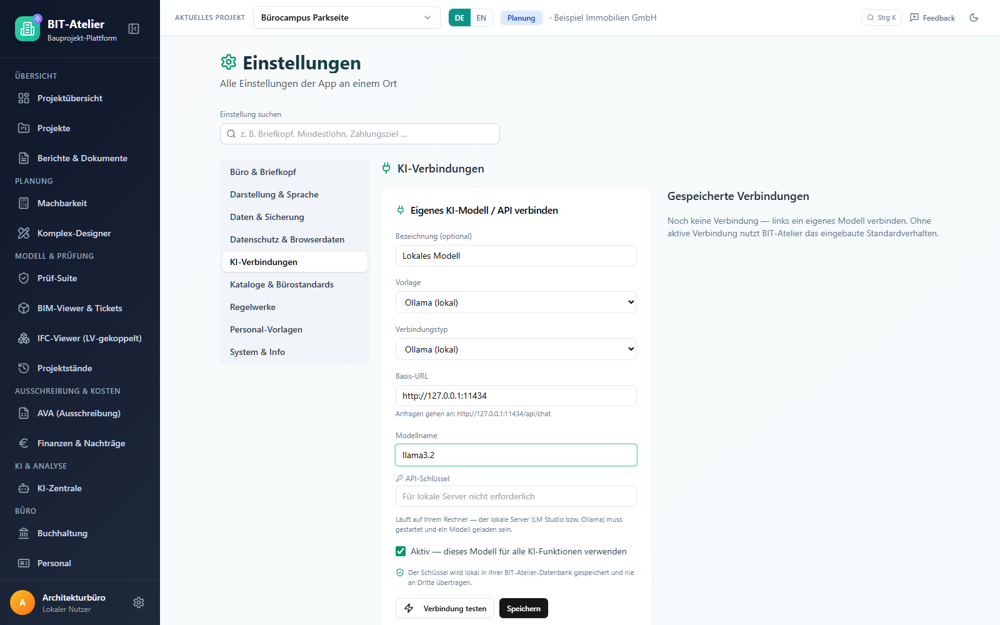

<div align="center">



# BIT-Atelier

**Die quelloffene Werkbank für Architekturbüros — von der ersten Massenstudie bis zur Schlussrechnung.**
**Modellprüfung, Ausschreibung (GAEB), Kostensteuerung und ein KI-Harness für jedes Modell. Läuft auf dem eigenen Rechner.**

[](LICENSE)
[](https://nodejs.org)
[](#datenschutz--lokal-zuerst)
[](#ki-harness--ihr-modell-ihre-wahl)
[](#andere-kis-arbeiten-mit-ihren-projekten-mcp)

[**Herunterladen**](#schnellstart) · [Funktionen](#was-die-app-kann) · [CAD & BIM](#arbeitet-mit-den-werkzeugen-die-sie-schon-haben) · [KI](#ki-harness--ihr-modell-ihre-wahl) · [Feedback](#feedback-erwünscht) · [English](README.md)



</div>

---

## Warum BIT-Atelier?

Architekturbüros arbeiten mit einem Dutzend lizenzierter Programme, die nicht miteinander reden:
CAD, Modellprüfer, AVA, Tabellen für die Kosten, Mails für die Befunde. BIT-Atelier ist **ein**
durchgängiger Projektfluss — **Idee → Entwurf → Ausschreibung → Bau → Abrechnung** — auf **einem
aktuellen Projekt**, gebaut von einem praktizierenden Architekten für den Büroalltag.

- **Lokal zuerst.** Modelle, Leistungsverzeichnisse und Rechnungen bleiben auf Ihrem Rechner. Die lokale App braucht kein Konto.
- **Offene Formate, keine Bindung.** IFC, IDS, BCF, GAEB, CSV/Excel, PDF — was hineingeht, kommt auch wieder heraus.
- **KI ohne Anbieterbindung.** Claude, GPT, Gemini, Mistral, Qwen, DeepSeek oder ein lokales Modell über Ollama oder LM Studio — oder Ihr eigener KI-Agent arbeitet über MCP mit Ihren Projekten.
- **Kostenlos.** MIT-Lizenz. Keine Lizenzkosten, die auf Ihr Honorar umgelegt werden.

> **Nutzung auf eigene Gefahr.** BIT-Atelier wird ohne Gewährleistung bereitgestellt (siehe [LICENSE](LICENSE)).
> Prüfergebnisse, Berechnungen und KI-Antworten sind Hinweise für Fachleute — sie ersetzen keine
> fachliche Prüfung, keine Statik und keinen gesetzlichen Nachweis.

---

## Schnellstart

### Weg A — herunterladen und starten (ohne Programmierkenntnisse)

1. Einmalig **[Node.js 22](https://nodejs.org)** (LTS) installieren.
2. **[BIT-Atelier.zip](https://github.com/mozzi86/bit-atelier-oss/releases/latest/download/BIT-Atelier.zip)** herunterladen und an beliebiger Stelle entpacken.
3. **`start-windows.cmd`** doppelklicken (Windows) bzw. **`./start.sh`** ausführen (macOS / Linux).

Beim ersten Start werden die Laufzeitpakete installiert (einige Minuten), dann öffnet sich der
Browser mit **http://localhost:3001**. Alles läuft auf Ihrem Rechner; Ihre Daten liegen im Ordner
`daten/` neben der App — sichern Sie ihn wie jeden anderen Projektordner.

### Weg B — aus dem Quellcode (Entwickler)

```bash
git clone https://github.com/mozzi86/bit-atelier-oss.git
cd bit-atelier-oss
npm install
npm run dev          # API auf :3001 + Vite-Entwicklungsserver auf :5173
```

```bash
npm run build && npm start   # Produktionsbau, App + API auf http://localhost:3001
npm run test:unit            # rund 3.000 Unit-Tests
npm run lint
```

### Weg C — gehostete Cloud (optional)

Eine gehostete Fassung mit Konten läuft unter **bit-atelier.pages.dev**. Konten werden von Hand
freigeschaltet: [Zugang anfragen](https://bit-atelier.pages.dev/registrieren) — das dauert in der
Regel ein paar Werktage. Die lokale App braucht kein Konto.

---

## Was die App kann

| Bereich | Inhalt |
|---|---|
| **Prüf-Suite** | Kollisionen zwischen Modellen, Duplikate, IDS-Regeln, Befundkarte je Geschoss, Prüfbericht als PDF, BCF hin und zurück, Befundliste als CSV/Excel. |
| **IFC-Viewer, LV-gekoppelt** | IFC-Modelle lokal öffnen (WebAssembly, nichts wird hochgeladen), Bauteile markieren, Mengen an LV-Positionen übergeben. |
| **Komplex-Designer** | Städtebauliches Massing-Studio mit Kennzahlen, Sonne und Verschattung, Wohnungsaufteilung, Rettungswegprüfung, Türen, Treppenraum und Aufzug, Balkone, Architekturbemaßung, IFC4-Export. |
| **AVA** | Leistungsverzeichnisse, GAEB-Import/-Export, Preisspiegel, Referenzpreise, Kostengruppen nach DIN 276, Vergabe und Abrechnung. |
| **Finanzen & Nachträge** | Nachträge je Projekt mit Genehmigung, verknüpft mit Tickets und Berichten. |
| **Büro** | Buchhaltung (Rechnungen, Liquidität, Umsatzsteuer, Jahresabschluss), Personal, Adressbuch — für kleine Büros und Freiberufler. |
| **Berichte** | Projektberichte, Planexporte und PDF-Importe — alles als PDF. |
| **KI-Zentrale** | Projekte bewerten, Daten auswerten, Routine automatisieren — mit dem Modell Ihrer Wahl. |

### In Bildern

<table>
  <tr>
    <td width="50%"><br /><sub><b>Prüf-Suite</b> — Kollisionen und IDS am Musterprojekt, Export als BCF/PDF/Excel, Befundkarte</sub></td>
    <td width="50%"><br /><sub><b>Komplex-Designer</b> — Wohnungsaufteilung eines Geschosses mit Räumen, Maßen und Wohnflächen</sub></td>
  </tr>
  <tr>
    <td width="50%"><br /><sub><b>AVA</b> — Leistungsverzeichnis mit Kostengruppen nach DIN 276, GAEB- und CSV-Export</sub></td>
    <td width="50%"><br /><sub><b>KI-Verbindungen</b> — Vorlage wählen, hier ein lokales Ollama-Modell ohne Schlüssel</sub></td>
  </tr>
</table>

---

## Arbeitet mit den Werkzeugen, die Sie schon haben

Ihr CAD-Programm bleibt Ihr CAD-Programm — BIT-Atelier liest und schreibt, was es exportiert.

| Format | Lesen | Schreiben | Typische Partner |
|---|:---:|:---:|---|
| **IFC** (web-ifc) | ✅ | ✅ IFC4 (Komplex-Designer) | Revit, Archicad, Allplan, Vectorworks, BricsCAD, Tekla — über deren IFC-Export |
| **IDS 1.0** | ✅ | ✅ | Auftraggeber-Anforderungen (AIA/BAP), buildingSMART-Werkzeuge |
| **BCF 2.1** | ✅ | ✅ | Solibri, BIMcollab, Catenda und andere BCF-fähige Prüfer |
| **GAEB DA XML** X81 · X82 · X83 · X84 · X86 | ✅ | ✅ X83 | AVA-Programme |
| **GAEB 90** (D81, D83, D84, P83) | ✅ | – | ältere AVA-Programme |
| **CSV / Excel** | ✅ | ✅ | LV, Preisspiegel, Befundliste, Kontoauszüge |
| **PDF** | ✅ ansehen | ✅ Berichte | alle |
| **GeoJSON** | ✅ Flurstücke | – | GIS, Katasterauszüge |
| **.bitproj** | ✅ | ✅ | Sicherung, Projekt umziehen |

Noch nicht unterstützt (Beiträge willkommen): DXF/DWG, BCF 3.0, OBJ/glTF, Punktwolken, CityGML.

---

## KI-Harness — Ihr Modell, Ihre Wahl

BIT-Atelier ist anbieterunabhängig. Sie entscheiden, mit welcher KI es spricht — in der Cloud oder ganz ohne Internet.

| Vorlage | Basis-Adresse | Hinweis |
|---|---|---|
| Anthropic | `https://api.anthropic.com` | Claude-Modelle |
| OpenAI | `https://api.openai.com/v1` | GPT-Modelle |
| Google Gemini | `https://generativelanguage.googleapis.com/v1beta/openai` | OpenAI-kompatibler Zugang |
| Mistral | `https://api.mistral.ai/v1` | |
| OpenRouter | `https://openrouter.ai/api/v1` | Hunderte Modelle hinter einem Schlüssel |
| Groq | `https://api.groq.com/openai/v1` | |
| DeepSeek | `https://api.deepseek.com` | |
| Qwen (DashScope) | `https://dashscope-intl.aliyuncs.com/compatible-mode/v1` | |
| LM Studio (lokal) | `http://127.0.0.1:1234/v1` | läuft komplett auf Ihrem Rechner |
| Ollama (lokal) | `http://127.0.0.1:11434` | läuft komplett auf Ihrem Rechner |
| Eigener Endpunkt | Ihre Adresse | jedes OpenAI-kompatible Gateway |

Einrichten unter *Einstellungen → KI-Verbindungen* (`/Settings?tab=ai`, auch aus der KI-Zentrale
verlinkt). Das Formular zeigt genau die Adresse, an die jede Anfrage geht. API-Schlüssel bleiben in
Ihrer Installation. Ohne Verbindung antwortet die App mit deutlich gekennzeichneten Platzhaltern.
Vorgaben gehen auch über `.env`: `ANTHROPIC_API_KEY` / `ANTHROPIC_MODEL`, `OPENAI_API_KEY` / `OPENAI_MODEL`.

**Der Harness (optional, Python 3.11–3.13):** ein anbieterunabhängiges Arbeitssystem mit
Projektgedächtnis, Datei- und IFC-Werkzeugen, Skills sowie Sprachein- und -ausgabe.

```bash
cd harness
python -m venv .venv && . .venv/bin/activate     # Windows: .venv\Scripts\activate
pip install -e ".[ifc]"
python -m harness serve                          # http://127.0.0.1:8765
```

Profile für Anthropic, OpenAI, Gemini, Mistral, OpenRouter, Ollama, LM Studio, Qwen/DashScope,
DeepSeek und Groq liegen bei — ein neuer Anbieter ist ein YAML-Block. Siehe [harness/README.md](harness/README.md).

### Andere KIs arbeiten mit Ihren Projekten (MCP)

BIT-Atelier bringt einen **Model-Context-Protocol-Server** mit. Claude Desktop, Claude Code oder
jeder andere MCP-Client kann Ihre Projekte lesen — und, wenn Sie es erlauben, ändern.

Zuerst BIT-Atelier starten, dann den Server mit dem absoluten Pfad zu Ihrem App-Ordner eintragen.

Claude Code:

```bash
claude mcp add bit-atelier -- node /pfad/zu/BIT-Atelier/tools/mcp-server.mjs
```

Claude Desktop und andere MCP-Clients (Abschnitt `mcpServers` der Client-Konfiguration):

```json
{ "mcpServers": { "bit-atelier": { "command": "node", "args": ["/pfad/zu/BIT-Atelier/tools/mcp-server.mjs"] } } }
```

Werkzeuge: `bit_status`, `list_entity_types`, `list_projects`, `get_project`, `list_records`,
`get_record` — standardmäßig nur lesend. Mit `--schreiben` (oder `--write`) in den Argumenten kommen
`create_record` und `update_record` dazu. Einzelheiten: [docs/KI-ANBINDUNG.md](docs/KI-ANBINDUNG.md).

---

## Datenschutz & lokal zuerst

- Die lokale App braucht **kein Konto** und sendet **keine Telemetrie**.
- IFC-Modelle werden **im Browser** gelesen (WebAssembly) und nie hochgeladen.
- Netzanfragen gehen nur dorthin, wohin Sie sie schicken: an Ihren KI-Anbieter, an Kartendienste, wenn Sie eine Karte öffnen.
- Feedback wird nur gesendet, wenn *Sie* eine Mail schreiben oder ein GitHub-Issue anlegen.

---

## Feedback erwünscht

Das Projekt ist jung, entstanden aus echter Büroarbeit, und es wird mit jeder Rückmeldung besser.

- **In der App:** Knopf *Feedback* → Mail an **me@bit-atelier.de** (Version und Seite nur, wenn Sie das Häkchen setzen) oder mit einem Klick ein GitHub-Issue.
- **Auf GitHub:** [Issue anlegen](https://github.com/mozzi86/bit-atelier-oss/issues/new/choose) — Fehler, Idee oder allgemeines Feedback.
- **Pull Requests** sind willkommen — Einstieg in [CONTRIBUTING.md](CONTRIBUTING.md).

---

## Haftungsausschluss & Lizenz

BIT-Atelier ist freie Software unter der **[MIT-Lizenz](LICENSE)**. Sie wird **ohne jede
Gewährleistung** bereitgestellt; die Nutzung erfolgt **auf eigene Gefahr**. Ergebnisse von
Prüfungen, Berechnungen und KI sind Hinweise für fachkundige Nutzer und ersetzen nie die fachliche
Verantwortung.

Fremdkomponenten behalten ihre eigenen Lizenzen — insbesondere web-ifc (MPL-2.0) und planegcs
(LGPL-2.0-or-later); siehe [THIRD-PARTY-LICENSES.md](THIRD-PARTY-LICENSES.md).

<div align="center"><sub>Von einem Architekten für Architekten · <a href="https://bit-atelier.de">bit-atelier.de</a></sub></div>
