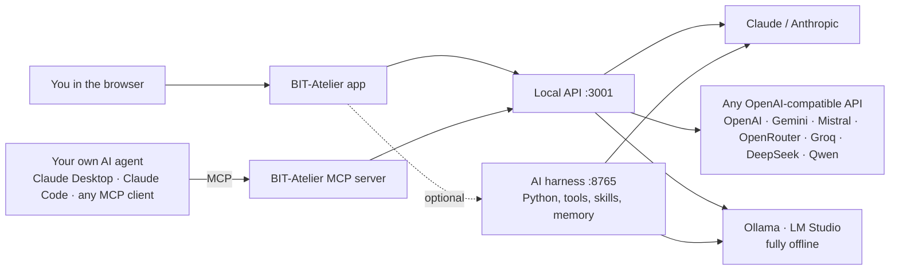

<div align="center">


# BIT-Atelier

**The open-source workbench for architects — from the first massing study to the final invoice.**
**BIM model checking, tendering (GAEB), cost control and an AI harness you can plug into any model. Runs on your own machine.**

[](LICENSE)
[](https://nodejs.org)
[](#privacy--local-first)
[](#ai-harness--bring-your-own-model)
[](#let-other-ais-work-with-your-projects-mcp)
[](CONTRIBUTING.md)

[**Download**](#quick-start) · [Features](#what-it-does) · [CAD & BIM interop](#works-with-the-tools-architects-already-use) · [AI](#ai-harness--bring-your-own-model) · [Feedback](#feedback-wanted) · [Deutsch](README.de.md)


</div>

---

## Why BIT-Atelier?

Architecture offices juggle a dozen licensed tools that do not talk to each other: a CAD program,
a model checker, an AVA/tendering tool, spreadsheets for costs, mail for issues. BIT-Atelier is one
coherent project flow — **idea → design → tender → build → invoice** — on **one current project**,
built by a practising architect for the daily work of an office.

- **Local-first.** Your models, tenders and invoices stay on your computer. No account needed for the local app.
- **Open file formats, no lock-in.** IFC, IDS, BCF, GAEB, CSV/Excel, PDF — what goes in comes back out.
- **AI without vendor lock-in.** Connect Claude, GPT, Gemini, Mistral, Qwen, DeepSeek or a local model via Ollama or LM Studio — or let your own AI agent work with your projects over MCP.
- **Free.** MIT licence. No licence fees passed on to your fee.

> **Use at your own risk.** BIT-Atelier is provided as is, without warranty (see [LICENSE](LICENSE)).
> Model checks, calculations and AI answers are hints for professionals — they do not replace a
> professional review, a structural calculation or a statutory certificate.

---

## Quick start

### Option A — download and run (no programming)

1. Install **[Node.js 22](https://nodejs.org)** (LTS) once.
2. Download **[BIT-Atelier.zip](https://github.com/mozzi86/bit-atelier-oss/releases/latest/download/BIT-Atelier.zip)** and unzip it anywhere.
3. Double-click **`start-windows.cmd`** (Windows) or run **`./start.sh`** (macOS / Linux).

The first start installs the runtime packages (a few minutes), then your browser opens
**http://localhost:3001**. Everything runs on your machine; your data lives in the folder `daten/`
next to the app — back it up like any other project folder.

### Option B — from source (developers)

```bash
git clone https://github.com/mozzi86/bit-atelier-oss.git
cd bit-atelier-oss
npm install
npm run dev          # API on :3001 + Vite dev server on :5173 with hot reload
```

```bash
npm run build && npm start   # production build, app + API on http://localhost:3001
npm run test:unit            # ~3,000 unit tests
npm run lint
```

### Option C — hosted cloud (optional)

A hosted version with accounts runs at **bit-atelier.pages.dev**. Accounts are approved by hand:
[request access](https://bit-atelier.pages.dev/registrieren) — it usually takes a few working days.
The local app needs no account at all.

---

## What it does

| Area | What you get |
|---|---|
| **Model checking (Prüf-Suite)** | Clash detection between models, duplicate elements, IDS rule checks, findings map per storey, PDF report, BCF round-trip, CSV/Excel findings list. |
| **IFC viewer, LV-coupled** | Open IFC models locally (WebAssembly, nothing is uploaded), pick elements, push quantities into bill-of-quantities positions. |
| **Massing & design (Komplex-Designer)** | Urban massing studio with key figures, sun & shading, apartment tessellation, escape-route length check, doors, stair core & lift, balconies, architectural dimensioning, IFC4 export. |
| **Tendering & award (AVA)** | Bills of quantities, GAEB import/export, price comparison, reference prices, cost groups (DIN 276), award and settlement. |
| **Costs & change orders** | Change orders per project with approval workflow, linked to tickets and reports. |
| **Office** | Bookkeeping (invoices, liquidity, VAT, annual accounts), people, address book — for small offices and freelancers. |
| **Reports** | Project reports, plan exports and PDF imports — everything as PDF. |
| **AI centre** | Evaluate projects, analyse data, automate routine steps — with the model of your choice. |

<details>
<summary><b>All modules</b></summary>

| Group | Module | Route |
|---|---|---|
| Overview | Project overview · Projects · Reports & documents | `/Dashboard` `/Projects` `/Reports` |
| Design | Feasibility · Komplex-Designer (massing studio) | `/RealEstateFeasibility` `/ComplexDesigner` |
| Model & checking | Prüf-Suite · BIM viewer & tickets · IFC viewer (LV-coupled) · Project states | `/ModelCheck` `/BimViewer` `/IfcViewer` `/ModelVersions` |
| Tender & costs | AVA (tendering) · Finance & change orders | `/AVA` `/Finance` |
| AI & analysis | AI centre | `/AIDashboard` |
| Office | Bookkeeping · People · Address book · Settings | `/Accounting` `/People` `/AddressBook` `/Settings` |
| Lab *(experimental)* | Constraint sketcher · Site control · Investment · PDF & filing · Development portfolio · AI tool | `/SketchStudio` `/SiteControl` `/InvestmentPlatform` `/BitAegis` `/AtelierDeveloper` `/KiTool` |

</details>

### In pictures

<table>
  <tr>
    <td width="50%"><br /><sub><b>Prüf-Suite</b> — clashes and IDS of the sample project, BCF/PDF/Excel export, findings map</sub></td>
    <td width="50%"><br /><sub><b>Komplex-Designer</b> — apartment tessellation of a storey with rooms, dimensions and living areas</sub></td>
  </tr>
  <tr>
    <td width="50%"><br /><sub><b>AVA</b> — bill of quantities with DIN 276 cost groups, GAEB and CSV export</sub></td>
    <td width="50%"><br /><sub><b>AI connections</b> — pick a preset, here a local Ollama model without any key</sub></td>
  </tr>
</table>

---

## Works with the tools architects already use

BIT-Atelier speaks the open exchange formats of the building industry. Your CAD program stays your
CAD program — BIT-Atelier reads and writes what it exports.

| Format | Read | Write | Typical partner tools |
|---|:---:|:---:|---|
| **IFC** (via web-ifc) | ✅ | ✅ IFC4 (Komplex-Designer) | Revit, Archicad, Allplan, Vectorworks, BricsCAD, Tekla — via their IFC export |
| **IDS 1.0** (Information Delivery Specification) | ✅ | ✅ | buildingSMART IDS tooling, client requirements (AIA/BAP) |
| **BCF 2.1** | ✅ | ✅ | Solibri, BIMcollab, Catenda and other BCF-capable checkers |
| **GAEB DA XML** X81 · X82 · X83 · X84 · X86 | ✅ | ✅ X83 | AVA/tendering software in Germany |
| **GAEB 90** (D81, D83, D84, P83) | ✅ | – | legacy tendering tools |
| **CSV / Excel (XLSX)** | ✅ | ✅ | bills of quantities, price comparison, findings list, bank statements |
| **PDF** | ✅ view | ✅ reports | everyone |
| **GeoJSON** | ✅ parcels | – | GIS, cadastral exports |
| **.bitproj** project file | ✅ | ✅ | backup / move a project between machines |

Not yet supported (contributions welcome): DXF/DWG, BCF 3.0, OBJ/glTF, point clouds, CityGML.

---

## AI harness — bring your own model

BIT-Atelier is model-agnostic. You decide which AI it talks to — in the cloud or completely offline.



**In the app:** *Settings → AI connections* (`/Settings?tab=ai`, also linked from the AI centre) → pick a template:

| Template | Base URL | Notes |
|---|---|---|
| Anthropic | `https://api.anthropic.com` | Claude models |
| OpenAI | `https://api.openai.com/v1` | GPT models |
| Google Gemini | `https://generativelanguage.googleapis.com/v1beta/openai` | OpenAI-compatible endpoint |
| Mistral | `https://api.mistral.ai/v1` | |
| OpenRouter | `https://openrouter.ai/api/v1` | hundreds of models behind one key |
| Groq | `https://api.groq.com/openai/v1` | |
| DeepSeek | `https://api.deepseek.com` | |
| Qwen (DashScope) | `https://dashscope-intl.aliyuncs.com/compatible-mode/v1` | |
| LM Studio (local) | `http://127.0.0.1:1234/v1` | runs entirely on your machine |
| Ollama (local) | `http://127.0.0.1:11434` | runs entirely on your machine |
| Custom endpoint | your URL | any OpenAI-compatible gateway |

The form shows the exact address each request goes to. API keys stay in your local installation.
Without any connection the app answers with clearly marked placeholder responses, so nothing breaks.
Defaults can also come from `.env`: `ANTHROPIC_API_KEY` / `ANTHROPIC_MODEL`, `OPENAI_API_KEY` / `OPENAI_MODEL`.

**The harness (optional, Python 3.11–3.13):** a provider-agnostic working system with project memory,
file and IFC tools, skills and voice in/out.

```bash
cd harness
python -m venv .venv && . .venv/bin/activate     # Windows: .venv\Scripts\activate
pip install -e ".[ifc]"
python -m harness serve                          # http://127.0.0.1:8765
```

Profiles for Anthropic, OpenAI, Gemini, Mistral, OpenRouter, Ollama, LM Studio, Qwen/DashScope,
DeepSeek and Groq are included — adding a provider is one YAML block. See [harness/README.md](harness/README.md).

### Let other AIs work with your projects (MCP)

BIT-Atelier ships a **Model Context Protocol server**, so Claude Desktop, Claude Code or any MCP client
can read your projects — and, if you allow it, write to them.

Start BIT-Atelier first, then register the server with an absolute path to your app folder.

Claude Code:

```bash
claude mcp add bit-atelier -- node /path/to/BIT-Atelier/tools/mcp-server.mjs
```

Claude Desktop and other MCP clients (`mcpServers` section of the client configuration):

```json
{ "mcpServers": { "bit-atelier": { "command": "node", "args": ["/path/to/BIT-Atelier/tools/mcp-server.mjs"] } } }
```

Tools: `bit_status`, `list_entity_types`, `list_projects`, `get_project`, `list_records`, `get_record` —
read-only by default. Add `--schreiben` (or `--write`) to the args to also allow `create_record` and
`update_record`. Details: [docs/KI-ANBINDUNG.md](docs/KI-ANBINDUNG.md).

---

## Privacy & local-first

- The local app needs **no account** and sends **no telemetry**.
- IFC models are parsed **in your browser** (WebAssembly) — they are never uploaded.
- Network requests only go where you send them: your chosen AI provider, map tiles if you open a map.
- Feedback is only sent if *you* write a mail or open a GitHub issue.

---

## Feedback wanted

This is a young project built from real office work, and it gets better with every report.

- **In the app:** *Feedback* button → mail to **me@bit-atelier.de** (version and page attached only if you tick the box), or open a GitHub issue with one click.
- **On GitHub:** [open an issue](https://github.com/mozzi86/bit-atelier-oss/issues/new/choose) — bug, idea or general feedback.
- **Pull requests** are welcome — start with [CONTRIBUTING.md](CONTRIBUTING.md).

---

## Under the hood

| Layer | Technology |
|---|---|
| Frontend | React 18, Vite, Tailwind, shadcn/ui, three.js, MapLibre, recharts, jsPDF |
| BIM | web-ifc (WebAssembly), own IDS/BCF/GAEB readers and writers |
| Local API | Node.js + Express on `127.0.0.1:3001`, JSON database in `daten/` (start scripts) or `server/` (development), configurable with `BIT_DATA_DIR` |
| Serverless mode | IndexedDB, installable PWA, works offline (`npm run build:lokal`) |
| Hosted mode | Supabase (auth, Postgres with row-level security, edge functions) |
| AI harness | Python, FastAPI, provider profiles (Anthropic or OpenAI-compatible transport) |
| Quality | ~3,000 unit tests (node:test), Playwright end-to-end specs, ESLint with package-boundary rules |

Monorepo layout: `packages/nova-core` (UI kit, data layer), `packages/nova-ifc-viewer` (IFC, model checking),
`packages/nova-ausschreibung` (AVA, GAEB), `packages/nova-designer` (massing & design), `packages/nova-pdf`,
`src/` (app shell, office modules), `server/` (local API), `harness/` (AI harness), `supabase/` (hosted backend).

---

## Roadmap

- Desktop client (Tauri) with a data folder per user
- DXF/DWG import for site plans and existing floor plans
- BCF 3.0 and IFC 4.3 verification
- Full English UI (most screens are German today)
- Larger sample project with spaces, quantities and DIN 276 classes (already started)

---

## Disclaimer & licence

BIT-Atelier is free software under the **[MIT licence](LICENSE)**. It is provided **as is, without
warranty of any kind**; you use it **at your own risk**. Results of checks, calculations and AI are
hints for qualified professionals and never replace professional responsibility.

Third-party components keep their own licences — notably web-ifc (MPL-2.0) and planegcs
(LGPL-2.0-or-later); see [THIRD-PARTY-LICENSES.md](THIRD-PARTY-LICENSES.md).

<div align="center"><sub>Made in Germany by an architect, for architects · <a href="https://bit-atelier.de">bit-atelier.de</a></sub></div>
